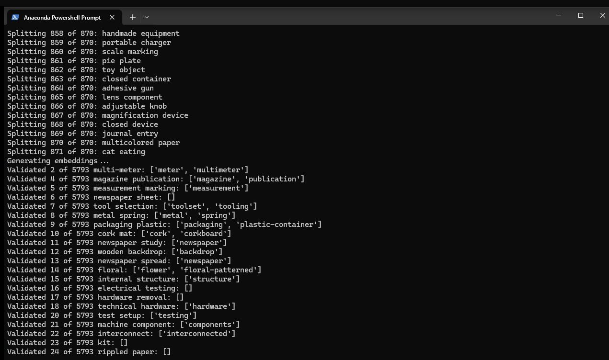

# Keyword Expander

A tool for processing and expanding image metadata tags using semantic similarity and LLM validation. This tool helps organize image collections by identifying and grouping related tags while maintaining semantic hierarchies.

## Features

- Extracts existing metadata tags from images
- Splits compound terms based on uniqueness ratio
- Generates semantic embeddings for tags using llama.cpp
- Identifies semantically similar tags using FAISS
- Validates tag relationships using LLM
- Updates image metadata with expanded tag sets
- Preserves semantic hierarchies (e.g., "metal" -> "material" but not "metal" -> "brass")
- Uses only the already existing keywords in your image library metadata



## Requirements

- Python 3.8+
- ExifTool
- llama.cpp embedding server
- KoboldCpp

Python dependencies:
```
exiftool
numpy
faiss-cpu
json-repair
koboldapi-python
```

## Installation

1. Install ExifTool for your platform: https://exiftool.org/
2. Clone this repository
3. Install Python dependencies: `pip install -r requirements.txt`
4. Download a GGUF format embedding model (e.g., all-MiniLM-L6-v2) and language model (e.g., gemma-2-2b-it)
5. Build or obtain llama.cpp and place llamacpp-embedding and needed binaries in the KeywordExpander folder
6. Download Koboldcpp launch it with the language model
   

## Usage

Basic usage:
```bash
python KeywordExpander.py /path/to/image/directory \
    --model-path /path/to/embedding-model.gguf \
    --llama-path /path/to/llama-embedding \
    --api-url http://localhost:5001
```

The script will:
1. Extract current metadata from images
2. Generate tag embeddings
3. Find similar tags
4. Validate relationships using LLM
5. Update image metadata with expanded tags

## Output Files

The script generates JSON files in the target directory:
- `KeywordExpander_metadata.json`: Raw metadata from images
- `KeywordExpander_expansions.json`: Expansion mappings

## How It Works

The script does the following:

1. Collects all of the keywords for images in a directory and all its subdirectories
2. Divides single word keywords and multiple word keywords which it calls 'compounds'. Compounds are composed of a 'modifier' as the first word and a 'base' as the last word and a possible conjuction in the middle which would be 'and' or 'or'
3. Any two word compounds that have a modifier as a common color get split into two single keywords, so ```'blue car' and 'red car' become 'blue', 'red', and 'car'```
4. Any remaining two word compounds get analyzed by taking the total number of unique modifier and base pairs and dividing them by the total number of terms with that modifier to give a number between 0 and 1. Example: ```'wooden table', 'wooden floor', 'wooden floor', 'wooden leg' count 3 uniques and 4 total for 3 / 4 = 0.75.``` If this number is above a threshhold and the total number of modifier occurances meet a certain minimum then the any compounds with that modifier are split into single words. For the previous example with a setting of 0.75 we would get ```'wooden', 'table', 'beam', 'floor', 'leg'```
5. The lists of singles and doubles are combined and deduplicated so that only one of any specific keyword is in the list, and the list is sent to llama.cpp's embedding engine and then they are indexed using FAISS and the similarity between all of the is checked. If any compounds or single words are similiar enough they are mapped together as a 'Keyword' and a list of 'Candidates' to be used along with that keyword any time it appears in image metadata. For instance 'dog' would be a keyword with a candidate list of 'poodle', 'canine', 'mammal', 'pet'
6. Each keyword and candidate list is sent to an LLM using the KoboldCpp API with a prompt asking it to validate any appropriate candidates and discard any inappropriate candidates. Qualifications for validation are that it is an exact synonym or a parent category of the keyword. In the previous case for 'dog', 'canine' and 'mammal' would be validated and 'poodle' discarded because a 'poodle' is a subtype of 'dog' -- we wouldn't want 'poodle' attached to every image where there is a dog because the dog in every image may not be a poodle
7. When the validations are complete the validated candidates are added to every image where the keyword is present, keeping the image's original keywords as well
8. In this way we hope to expand the relevant keywords to each appropriate image
    
## Credits
Invaluable assistance provided by ocha221. After reaching out for solutions they kindly wrote a working implementation of the idea:
- https://github.com/ocha221/semantic-tagging-tools

## License

This project is licensed under GPLv3. See the LICENSE file for details.
semantic-tagging-tools is licensed under MIT.
Llama.cpp is licensed under MIT.

## Contributing

Contributions are welcome! Please feel free to submit a Pull Request.
